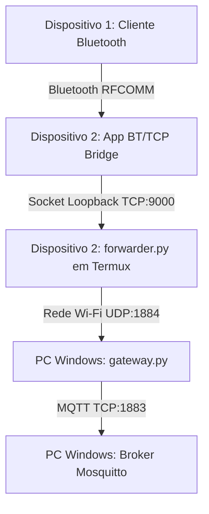

# 📡 Encaminhador MQTT-SN (Bluetooth RFCOMM para IP / UDP)


Este repositório contém a documentação, código-fonte e validação prática de um **Encaminhador (Forwarder) MQTT-SN** transparente. O projeto estabelece uma ponte de comunicação entre um dispositivo cliente sem suporte nativo a redes IP (comunicação via Bluetooth RFCOMM) e um Gateway MQTT-SN operando sobre a pilha IP (UDP) numa rede Wi-Fi local, integrando o fluxo final num Broker MQTT (Mosquitto).

---

## 📋 Sumário
- [1. Introdução e Objetivos](#-1-introdução-e-objetivos)
- [2. Arquitetura do Sistema](#-2-arquitetura-do-sistema)
- [3. Dispositivos e Tecnologias](#-3-dispositivos-e-tecnologias)
- [4. Código-Fonte (`forwarder.py`)](#-4-código-fonte-forwarderpy)
- [5. Como Executar o Projeto](#-5-como-executar-o-projeto)
- [6. Evidências de Validação](#-6-evidências-de-validação)
- [7. Conclusão](#-7-conclusão)

---

## 🎯 1. Introdução e Objetivos

O objetivo deste projeto é implementar e validar a transmissão de dados no protocolo **MQTT-SN** através de um cenário de rede heterogênea:
- **Origem:** Dispositivo móvel cliente enviando mensagens MQTT-SN via Bluetooth.
- **Intermediário:** Dispositivo móvel atuando como Encaminhador (Forwarder) de camada de aplicação/transporte.
- **Destino:** Computador executando o Gateway MQTT-SN e um Broker MQTT Mosquitto sobre rede local IP (UDP/TCP).

---

## 🏗️ 2. Arquitetura do Sistema

### Diagrama de Fluxo de Dados



### 💡 Justificativa Técnica

Devido às restrições de segurança do Android (SELinux) no ambiente Termux — que impedem a abertura direta de sockets de kernel `AF_BLUETOOTH` sem privilégios de superusuário (*root*) —, adotou-se o seguinte padrão de arquitetura:
1. O aplicativo **BT/TCP Bridge** abstrai a interface física do rádio Bluetooth e expõe o fluxo de bytes brutos numa porta TCP de loopback local (`127.0.0.1:9000`).
2. O script **`forwarder.py`** conecta-se a essa porta local, atua como um repassador transparente de pacotes e os envia via **UDP** para o computador na porta `1884`.

---

## 📱 3. Dispositivos e Tecnologias

| Dispositivo | Papel na Rede | Software / Ferramentas | Endereçamento / Porta |
| :--- | :--- | :--- | :--- |
| **Moto G54 (1)** | Cliente MQTT-SN | Serial Bluetooth Terminal | Bluetooth RFCOMM |
| **Moto G54 (2)** | Encaminhador (Forwarder) | BT/TCP Bridge + Termux (`forwarder.py`) | TCP Local: `9000` / IP Wi-Fi |
| **PC Windows** | Gateway & Broker | Python (`gateway.py`) + Mosquitto Broker | UDP: `1884` / TCP MQTT: `1883` |

---

## 💻 4. Código-Fonte: `forwarder.py`

```python
import socket
import time

# Configurações de Rede
LOCAL_BRIDGE_IP = "127.0.0.1"
LOCAL_BRIDGE_PORT = 9000   # Porta disponibilizada pela ponte Bluetooth local
PC_IP = "192.168.0.9"      # Endereço IP do Gateway (PC)
UDP_PORT = 1884            # Porta UDP do Gateway MQTT-SN

# Instanciação do socket UDP para encaminhamento de pacotes
udp_sock = socket.socket(socket.AF_INET, socket.SOCK_DGRAM)

print(f"[FORWARDER] Tentando conectar à ponte local em {LOCAL_BRIDGE_IP}:{LOCAL_BRIDGE_PORT}...")

# Aguarda a inicialização do serviço de bridge Bluetooth
while True:
    try:
        tcp_bridge = socket.socket(socket.AF_INET, socket.SOCK_STREAM)
        tcp_bridge.connect((LOCAL_BRIDGE_IP, LOCAL_BRIDGE_PORT))
        print("[FORWARDER] Conectado com sucesso à ponte do app!")
        break
    except ConnectionRefusedError:
        print("[FORWARDER] Aguardando o app BT/TCP Bridge iniciar no Celular 2 (porta 9000)...")
        time.sleep(2)

try:
    while True:
        # Leitura dos bytes brutos recebidos via Bluetooth
        data = tcp_bridge.recv(1024)
        if not data:
            print("[FORWARDER] Conexão encerrada pelo cliente.")
            break
        
        print(f"[FORWARDER] {len(data)} bytes recebidos via Bluetooth -> Encaminhando UDP para {PC_IP}:{UDP_PORT}")
        
        # Envio transparente do pacote MQTT-SN ao Gateway
        udp_sock.sendto(data, (PC_IP, UDP_PORT))

except Exception as e:
    print(f"[FORWARDER] Erro de execução: {e}")
finally:
    tcp_bridge.close()
    udp_sock.close()
    print("[FORWARDER] Encaminhador finalizado.")
```

---

## 🚀 5. Como Executar o Projeto

### Passo 1: No Computador (Gateway & Broker)
1. Inicie o broker Mosquitto:
   ```cmd
   cd "C:\Program Files\Mosquitto"
   mosquitto.exe -v -c mosquitto.conf
   ```
2. Execute o script do Gateway em outra janela do CMD:
   ```cmd
   cd C:\Projetos\MQTT
   python gateway.py
   ```

### Passo 2: No Celular 2 (Forwarder)
1. Abra o **BT/TCP Bridge**:
   * **Device A:** Configurado como `Open Bluetooth listening socket`.
   * **Device B:** Configurado como `Start TCP server` na porta `9000`.
   * Ative a ponte.
2. No **Termux**, execute o script de encaminhamento:
   ```bash
   python forwarder.py
   ```

### Passo 3: No Celular 1 (Cliente)
1. Abra o **Serial Bluetooth Terminal** e conecte-se ao Celular 2.
2. Vá em `Settings > Send` e defina o **Edit mode** para **HEX**.
3. Envie o pacote `PUBLISH` MQTT-SN em bytes:
   ```text
   0F0C00000100014D656E736167656D
   ```

---

## 📸 6. Evidências de Validação

### Validação 1: Emissão do Pacote no Cliente (Celular 1)
O pacote contendo a payload hexadecimal do protocolo foi transmitido via rádio Bluetooth RFCOMM.


*Figura 1: Envio do pacote no aplicativo Serial Bluetooth Terminal.*

---

### Validação 2: Captura e Repasse Transparente (Celular 2)
O script `forwarder.py` captura os 17 bytes oriundos da ponte local e realiza o repasse imediato via UDP.


*Figura 2: Log de execução do forwarder no Termux encaminhando os bytes.*

---

### Validação 3: Recepção, Decodificação e Publicação no Gateway (PC)
O `gateway.py` no PC recebe o datagrama UDP, extrai a payload `'Mensagem'` do pacote `PUBLISH` MQTT-SN e publica com sucesso no Broker Mosquitto no tópico `topico/bluetooth`.


*Figura 3: Log do Gateway processando a mensagem e entregando ao Mosquitto.*

---

## 📝 7. Conclusão

A solução desenvolvida atendeu integralmente aos requisitos da atividade prática. A arquitetura adotada contornou com sucesso as restrições de permissão de rádio no ambiente Android sem a necessidade de acesso *root*, mantendo a integridade dos pacotes MQTT-SN transmitidos fim a fim através da ponte Bluetooth-IP.
